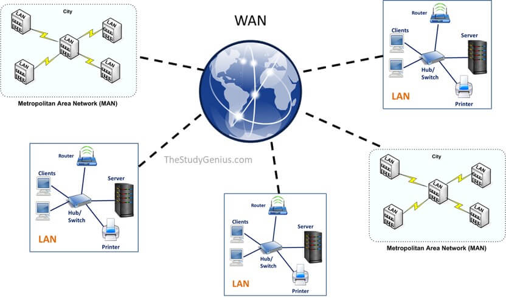
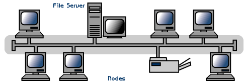
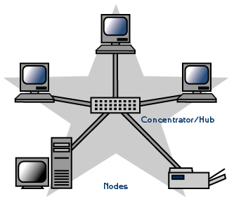
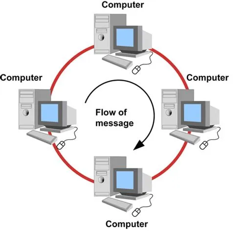
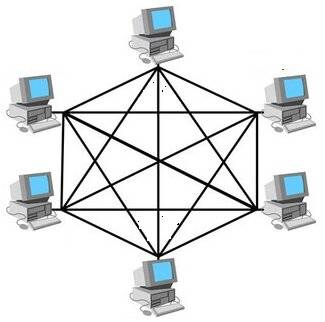
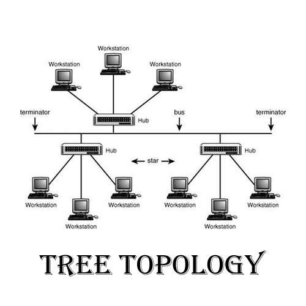
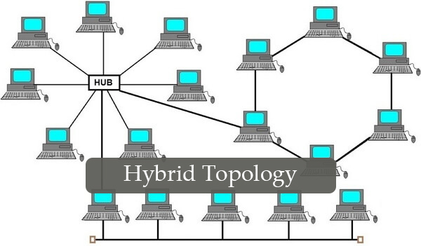

# Bilgisayar Ağları

## **1. Bilgisayar Ağı Nedir?**

En basit tanımıyla **bilgisayar ağı (computer network)**, iki veya daha fazla bilgisayarın veya ağa bağlanabilen cihazın (yazıcılar, sunucular, akıllı telefonlar, IoT cihazları vb.) birbirleriyle iletişim kurabilmesi ve kaynakları (dosyalar, yazıcılar, internet bağlantısı vb.) paylaşabilmesi amacıyla, belirli iletişim protokolleri kullanılarak kablolu veya kablosuz ortamlar aracılığıyla birbirine bağlanmasıyla oluşan sistemdir.

### **Veri İletişimi**

Veri iletişimi, iki cihaz arasında iletim ortamı aracılığıyla yapılan veri alışverişidir. Veri
iletişiminin gerçekleşmesi için, iletişim kuran cihazların, donanım ve yazılım
kombinasyonundan oluşan bir iletişim sisteminin parçası olması gerekir. Bir veri iletişim
sisteminin etkinliği dört temel özelliğe bağlıdır: delivery, accuracy, timeliness ve jitter.

**Delivery:** Sistem verileri doğru hedefe iletmelidir. Veriler amaçlanan cihaz veya kullanıcı
tarafından ve yalnızca o cihaz veya kullanıcı tarafından alınmalıdır.

**Accuracy:** Sistem verileri doğru bir şekilde iletmelidir. İletim sırasında değiştirilen ve
düzeltilmeden bırakılan veriler kullanılamaz.

**Timeliness:** Sistem verileri zamanında teslim etmelidir. Geç teslim edilen veriler işe
yaramaz.

**Jitter:** Jitter, paketin varış süresindeki değişimi ifade eder. Ses veya video paketlerinin
teslimindeki düzensiz gecikmedir.

### **Veri Akışı**
İki cihaz arasındaki iletişim 3 biçimde gerçekleşebilir; simplex, half-duplex, full-duplex.

**Simplex:** Simplex modunda iletişim tek yönlüdür. Bir bağlantıdaki iki cihazdan yalnızca
biri iletim yapabilir; diğeri yalnızca alabilir. Klavyeler ve geleneksel monitörler simplex
cihazlara örnektir. Klavye yalnızca girişi tanıtabilir; monitör yalnızca çıkışı kabul edebilir.

**Half-Duplex:** Bu modda, her istasyon hem iletim hem de alım yapabilir, ancak aynı anda
olamaz. Bir cihaz gönderirken diğeri yalnızca alabilir ve bunun tersi de geçerlidir
Telsizler half-duplex sistemlerdir.

**Full-Duplex:** Bu modda, her iki istasyon da aynı anda iletim ve alım yapabilir.
Full-Duplex modda, bir yöne giden sinyaller, bağlantının kapasitesini diğer yöne giden
sinyallerle paylaşır. Telefon ağı iyi bir örnektir. İki kişi telefon hattı üzerinden iletişim
kurduğunda, her ikisi de aynı anda hem konuşabilir hem de dinleyebilir.

### **Bileşenler**

Bir veri iletişim sisteminin 5 bileşeni vardır.

**1. Message :** Mesaj, iletilecek bilgidir (veri). Popüler bilgi biçimleri arasında metin,
sayılar, resimler, ses ve video yer alır.

**2. Sender:** Sender, veri mesajını gönderen cihazdır. Bu bir bilgisayar, bir telefon vb.
olabilir.

**3. Receiver:** Receiver, mesajı alan cihazdır. Bu bir bilgisayar, iş istasyonu vb. olabilir.

**4. Transmission Medium:** İletim ortamı, bir mesajın göndericiden alıcıya iletildiği
fiziksel yoldur. İletim ortamının bazı örnekleri arasında UTP kablo, fiber optik
kablo ve radyo dalgaları bulunur.

**5. Protocol:** Protokol, veri iletişimini yöneten bir dizi kuraldır. İletişim kuran cihazlar
arasındaki anlaşmayı temsil eder. Bir protokol olmadan, iki cihaz birbirine
bağlanabilir ancak iletişim kuramayabilir.

### **Bilgisayar Ağlarının Temel Amaçları:**

*   **Kaynak Paylaşımı:** Ağ üzerindeki kullanıcıların pahalı donanımları (yazıcılar, tarayıcılar, depolama birimleri) ve yazılımları ortaklaşa kullanmasını sağlar. Bu, maliyetleri düşürür ve verimliliği artırır.
*   **İletişim Kolaylığı:** E-posta, anlık mesajlaşma, video konferans gibi araçlarla kullanıcılar arasında hızlı ve etkili iletişim kurulmasını sağlar.
*   **Bilgiye Erişim ve Paylaşım:** Ağ üzerindeki merkezi sunucularda veya diğer bilgisayarlarda depolanan verilere ve bilgilere yetkili kullanıcıların kolayca erişmesini ve paylaşmasını mümkün kılar.
*   **Merkezi Yönetim ve Destek:** Ağ yöneticilerinin, ağdaki tüm bilgisayarları ve cihazları merkezi bir noktadan yönetmesine, yazılım güncellemeleri yapmasına ve teknik destek sağlamasına olanak tanır.
*   **Eğlence ve Çoklu Ortam:** Çevrimiçi oyunlar, video akışı (streaming) gibi eğlence hizmetlerinin sunulmasını sağlar.

### **Ağ Türleri (Ölçeklerine Göre):**

*   **LAN (Local Area Network - Yerel Alan Ağı):** Genellikle tek bir bina, ofis katı veya ev gibi sınırlı bir coğrafi alandaki cihazları birbirine bağlar. Ethernet ve Wi-Fi en yaygın LAN teknolojileridir.
*   **MAN (Metropolitan Area Network - Metropol Alan Ağı):** Bir şehir veya büyük bir kampüs gibi LAN'dan daha geniş, ancak WAN'dan daha dar bir coğrafi alanı kapsar. Genellikle birden fazla LAN'ı birbirine bağlar.
*   **WAN (Wide Area Network - Geniş Alan Ağı):** Çok geniş coğrafi alanları (şehirlerarası, ülkelerarası, hatta kıtalararası) kapsayan ağlardır. İnternet, en büyük WAN örneğidir. WAN'lar genellikle kiralanmış telekomünikasyon hatları veya uydu bağlantıları kullanır.
*   **PAN (Personal Area Network - Kişisel Alan Ağı):** Bir kişinin etrafındaki çok kısa mesafedeki cihazları (örneğin, Bluetooth ile bağlanan kulaklık ve telefon) birbirine bağlar.

[[1]](#kaynakça)

## **2. Bilgisayar Ağında Kullanılan Bileşenler**

Bir bilgisayar ağının çalışabilmesi için çeşitli donanım ve yazılım bileşenlerinin bir arada uyum içinde çalışması gerekir.

### **a) Donanım Bileşenleri:**

*   **Uç Cihazlar (End Devices / Hosts):** Kullanıcıların doğrudan etkileşimde bulunduğu veya ağ hizmetlerini başlatan/sonlandıran cihazlardır.
    *   Bilgisayarlar (Masaüstü, Dizüstü)
    *   Sunucular (Servers): Ağ kaynaklarını (dosyalar, web siteleri, uygulamalar) barındıran ve diğer cihazlara hizmet veren güçlü bilgisayarlar.
    *   Yazıcılar, Tarayıcılar
    *   IP Telefonlar
    *   Akıllı Telefonlar, Tabletler
    *   IoT Cihazları (Akıllı termostatlar, güvenlik kameraları vb.)
*   **Ara Bağlantı Cihazları (Intermediary Devices):** Ağdaki veri akışını yöneten, sinyalleri güçlendiren ve farklı ağları birbirine bağlayan cihazlardır.
    *   **Ağ Anahtarı (Switch):** Aynı ağ (LAN) içerisindeki cihazları birbirine bağlar ve veriyi sadece hedef porta yönlendirerek verimli iletişim sağlar. MAC adreslerine göre çalışır.
    *   **Yönlendirici (Router):** Farklı ağları (örneğin, ev ağınızı internete) birbirine bağlar ve verinin en uygun yoldan hedefe ulaşmasını sağlar. IP adreslerine göre çalışır.
    *   **Erişim Noktası (Access Point - AP):** Kablosuz cihazların kablolu ağa bağlanmasını sağlayan cihazdır. Genellikle Wi-Fi için kullanılır.
    *   **Modem (Modulator-Demodulator):** Dijital veriyi analog sinyallere (gönderme için) ve analog sinyalleri dijital veriye (alma için) dönüştürerek, bilgisayarların telefon hatları veya kablo TV hatları üzerinden iletişim kurmasını sağlar. Genellikle internet servis sağlayıcısına (ISP) bağlanmak için kullanılır.
    *   **Güvenlik Duvarı (Firewall):** Ağ trafiğini kontrol ederek yetkisiz erişimleri engelleyen ve ağı dış tehditlerden koruyan donanım veya yazılım tabanlı bir güvenlik sistemidir.
    *   **Hub (Tekrarlayıcı - Eski Teknoloji):** Kendisine bağlı tüm cihazlara gelen veriyi kopyalayarak gönderen basit bir bağlantı cihazıdır. Verimsizdir ve çarpışmalara (collisions) neden olabilir, günümüzde yerini büyük ölçüde switch'lere bırakmıştır.
*   **Ağ Ortamı (Network Media):** Verinin cihazlar arasında fiziksel olarak iletildiği kanaldır.
    *   **Kablolu Medya:**
        *   **Bakır Kablolar:**
            *   *Çift Bükümlü Kablo (Twisted Pair):* En yaygın kullanılan kablo türüdür (örn. Ethernet kabloları - Cat5e, Cat6). İçindeki tellerin bükümlü olması elektromanyetik paraziti azaltır. Korumalı (STP) ve korumasız (UTP) tipleri vardır.
            *   *Koaksiyel Kablo (Coaxial):* Merkezi bir iletken ve onu çevreleyen yalıtkan ve metal örgüden oluşur. Genellikle kablo TV ve bazı eski ağlarda kullanılır.
        *   **Fiber Optik Kablo:** Veriyi ışık sinyalleri olarak ileten cam veya plastik liflerden oluşur. Çok yüksek hızlar, uzun mesafeler ve elektromanyetik parazitlere karşı bağışıklık sunar. Daha pahalıdır.
    *   **Kablosuz Medya:**
        *   **Radyo Dalgaları (Wi-Fi, Bluetooth):** Belirli frekans aralıklarındaki radyo dalgalarını kullanarak veri iletimi sağlar.
        *   **Mikrodalga:** Yüksek frekanslı radyo dalgalarıdır, genellikle uzun mesafeli noktadan noktaya bağlantılarda kullanılır.
        *   **Uydu:** Dünya yörüngesindeki uydular aracılığıyla çok geniş coğrafi alanlar arasında iletişim sağlar.
*   **Ağ Arayüz Kartı (Network Interface Card - NIC):** Bilgisayarın veya diğer cihazların ağa fiziksel olarak bağlanmasını sağlayan donanım kartıdır. Her NIC'in dünya genelinde benzersiz bir MAC (Media Access Control) adresi vardır. Ethernet kartları ve Wi-Fi adaptörleri NIC örnekleridir.

### **b) Yazılım Bileşenleri:**

*   **Ağ İşletim Sistemi (Network Operating System - NOS):** Sunucularda çalışarak ağ kaynaklarının yönetimini, kullanıcı hesaplarını, güvenliği ve diğer ağ hizmetlerini sağlayan özel işletim sistemleridir (Örn: Windows Server, Linux dağıtımları, Novell NetWare - eski). Ayrıca istemci işletim sistemlerinin (Windows 10/11, macOS, Linux) ağa bağlanma ve kaynakları kullanma yetenekleri de önemlidir.
*   **İletişim Protokolleri (Communication Protocols):** Ağdaki cihazların birbirleriyle "aynı dili konuşmasını" sağlayan kurallar ve standartlar bütünüdür. Verinin nasıl biçimlendirileceğini, adresleneceğini, iletileceğini, alınacağını ve hataların nasıl yönetileceğini tanımlar. En yaygın protokol ailesi **TCP/IP**'dir (Transmission Control Protocol/Internet Protocol). Diğer önemli protokoller arasında HTTP, HTTPS, FTP, SMTP, POP3, IMAP, DNS, DHCP bulunur.
*   **Ağ Yönetim Yazılımları:** Ağ yöneticilerinin ağı izlemesine, yapılandırmasına, sorun gidermesine ve performansını optimize etmesine yardımcı olan araçlardır.
*   **Güvenlik Yazılımları:** Antivirüs programları, casus yazılım önleyiciler, izinsiz giriş tespit/önleme sistemleri (IDS/IPS) gibi yazılımlar ağı ve üzerindeki veriyi korur.

## **3. Bir Ağın Karakteristikleri**

Bir ağın ne kadar iyi çalıştığını ve amaca uygun olup olmadığını değerlendirmek için kullanılan temel karakteristikler şunlardır:

*   **Performans (Performance):** Ağın veriyi ne kadar hızlı ve verimli iletebildiğidir. İki ana ölçütü vardır:
    *   **Bant Genişliği (Bandwidth):** Ağın belirli bir sürede taşıyabileceği maksimum veri miktarıdır. Genellikle saniyede bit (bps), kilobit (Kbps), megabit (Mbps) veya gigabit (Gbps) olarak ölçülür.
    *   **Gecikme (Latency/Delay):** Bir veri paketinin kaynaktan hedefe ulaşması için geçen süredir. Düşük gecikme, özellikle gerçek zamanlı uygulamalar (video konferans, çevrimiçi oyunlar) için önemlidir.
    *   Performansı etkileyen faktörler: Bağlantı türü ve hızı, ağdaki kullanıcı sayısı, çalışan uygulamaların türü, ağ cihazlarının verimliliği, ağdaki tıkanıklık.
*   **Güvenilirlik (Reliability):** Ağın ne kadar istikrarlı çalıştığı ve hizmet kesintilerine ne kadar dayanıklı olduğudur.
    *   **Hata Toleransı (Fault Tolerance):** Ağın bir bileşeninde (kablo, cihaz vb.) arıza meydana geldiğinde bile çalışmaya devam edebilme yeteneğidir. Genellikle yedekli (redundant) bağlantılar ve cihazlar kullanılarak sağlanır.
    *   **Kullanılabilirlik (Availability):** Ağın veya ağ hizmetlerinin ne kadar süreyle erişilebilir olduğudur. Genellikle yüzde olarak ifade edilir (örn. %99.9 uptime).
*   **Güvenlik (Security):** Ağın ve üzerindeki verinin yetkisiz erişimlere, kötü amaçlı yazılımlara, veri hırsızlığına ve diğer tehditlere karşı korunmasıdır. Güvenlik önlemleri şunları içerir:
    *   Kimlik Doğrulama (Authentication): Kullanıcıların ve cihazların kimliğinin doğrulanması.
    *   Yetkilendirme (Authorization): Doğrulanmış kullanıcıların hangi kaynaklara erişebileceğinin belirlenmesi.
    *   Veri Şifreleme (Encryption): Verinin iletim sırasında okunamaz hale getirilmesi.
    *   Güvenlik Duvarları (Firewalls): Ağ trafiğinin filtrelenmesi.
    *   Saldırı Tespit ve Önleme Sistemleri (IDS/IPS).
*   **Ölçeklenebilirlik (Scalability):** Ağın, artan kullanıcı sayısı ve trafik yüküyle başa çıkabilmek için kolayca büyütülebilme yeteneğidir. İyi tasarlanmış bir ağ, yeni kullanıcılar ve hizmetler eklendikçe performansını koruyabilmelidir. Modüler tasarım, hiyerarşik yapı ve standart protokollerin kullanımı ölçeklenebilirliği artırır.

## **4. Ağ Topolojileri**

Ağ topolojisi, bir ağdaki cihazların fiziksel veya mantıksal olarak nasıl düzenlendiğini ve birbirine nasıl bağlandığını ifade eder.

*   **Fiziksel Topoloji:** Kabloların, cihazların ve diğer bileşenlerin gerçek fiziksel yerleşimini tanımlar.
*   **Mantıksal Topoloji:** Verinin ağ üzerinde cihazlar arasında nasıl aktığını, yani sinyalin izlediği yolu tanımlar. Bazen fiziksel topolojiden farklı olabilir (örneğin, fiziksel olarak yıldız şeklinde kurulan bir ağ, mantıksal olarak veri yolu gibi çalışabilir).

**Yaygın Fiziksel Topolojiler:**

*   **Veri Yolu (Bus) Topolojisi:** Tüm cihazlar, "backbone" (omurga) adı verilen tek bir ana kabloya bağlanır. Kablonun her iki ucunda sonlandırıcı (terminator) bulunur.
    *   *Avantajları:* Kurulumu basit ve ucuzdur, az kablo gerektirir.
    *   *Dezavantajları:* Ana kabloda bir sorun olursa tüm ağ çöker. Aynı anda sadece bir cihaz veri gönderebilir (çarpışma riski). Sorun giderme zordur. Performansı düşüktür. Günümüzde nadiren kullanılır.

    

    [[2]](#kaynakça)

*   **Yıldız (Star) Topolojisi:** Tüm cihazlar, merkezi bir bağlantı noktasına (genellikle bir switch veya hub) ayrı kablolarla bağlanır. En yaygın kullanılan LAN topolojisidir.
    *   *Avantajları:* Kurulumu ve yönetimi kolaydır. Bir cihazın veya kablonun arızalanması sadece o cihazı etkiler, ağın geri kalanı çalışmaya devam eder (merkezi cihaz arızalanmadıkça). Yeni cihaz eklemek/çıkarmak kolaydır. Sorun giderme daha basittir.
    *   *Dezavantajları:* Merkezi cihaza bağımlıdır; merkezdeki cihaz arızalanırsa tüm ağ durur. Veri yolu topolojisine göre daha fazla kablo gerektirir.

    

    [[2]](#kaynakça)

*   **Halka (Ring) Topolojisi:** Cihazlar, kapalı bir döngü oluşturacak şekilde birbirlerine bağlanır. Veri, genellikle tek yönde halka etrafında dolaşır (genellikle "token" adı verilen özel bir sinyal kullanılarak - Token Ring).
    *   *Avantajları:* Çarpışma olmaz (token passing mekanizması ile). Veri yolu topolojisine göre daha iyi performans gösterebilir.
    *   *Dezavantajları:* Halkadaki tek bir kablo veya cihaz arızası tüm ağı durdurabilir (bazı uygulamalarda çift halka ile yedeklilik sağlanır). Cihaz eklemek veya çıkarmak ağı geçici olarak durdurabilir. Sorun giderme zor olabilir.

    

    [[3]](#kaynakça)

*   **Örgü (Mesh) Topolojisi:** Her cihazın ağdaki diğer birçok cihaza (kısmi mesh) veya tüm diğer cihazlara (tam mesh) doğrudan bağlantısı vardır.
    *   *Avantajları:* Çok yüksek güvenilirlik ve hata toleransı sunar (bir bağlantı kopsa bile alternatif yollar bulunur). Trafik yükü dağıtılabilir.
    *   *Dezavantajları:* Çok fazla kablo gerektirir (özellikle tam mesh). Kurulumu ve yönetimi çok karmaşık ve pahalıdır. Genellikle WAN bağlantılarında veya kritik ağ omurgalarında kullanılır.

    

    [[4]](#kaynakça)

*   **Ağaç (Tree) veya Hiyerarşik Topoloji:** Yıldız topolojilerinin hiyerarşik bir şekilde birbirine bağlanmasıyla oluşur. Kök bir cihaz (genellikle bir switch veya router) vardır ve dallanarak diğer cihazlara veya yıldız gruplarına bağlanır.
    *   *Avantajları:* Ölçeklenebilirdir, ağı bölümlere ayırmayı kolaylaştırır. Yönetimi ve sorun gidermesi görece kolaydır.
    *   *Dezavantajları:* Üst seviyedeki bir cihazın veya bağlantının arızalanması, altındaki tüm dalları etkileyebilir. Omurga kablosuna bağımlıdır.

    

    [[5]](#kaynakça)

*   **Hibrit (Hybrid) Topoloji:** İki veya daha fazla farklı topolojinin birleştirilmesiyle oluşturulur (örn. bir yıldız ağı ile bir veri yolu ağının bağlanması).
    *   *Avantajları:* Farklı topolojilerin avantajlarını birleştirebilir, esneklik sunar.
    *   *Dezavantajları:* Tasarımı ve yönetimi karmaşık olabilir. Maliyeti artırabilir.

    

    [[6]](#kaynakça)

## **KAYNAKÇA**

[[1] WAN MAN LAN ](https://radhikaclasses.com/different-types-of-networks-pan-lan-man-wan/)

[[2] Bus and Star Topology](https://fcit.usf.edu/network/chap5/chap5.htm)

[[3] Ring Topology](https://medium.com/@boutnaru/the-networking-journey-ring-topology-b8b50ade8f10)

[[4] Mesh Topology](https://www.shiksha.com/online-courses/articles/what-is-mesh-topology-blogId-156361)

[[5] Tree Topology](https://itrelease.com/2021/04/advantages-and-disadvantages-of-tree-topology/)

[[6] Hybrid Topology](https://itrelease.com/2020/07/what-is-a-hybrid-topology-with-example/)

Forouzan, B. A. (2021). Data Communications and Networking with TCP/IP
Protocol Suite. McGraw-Hill US Higher Ed USE.

