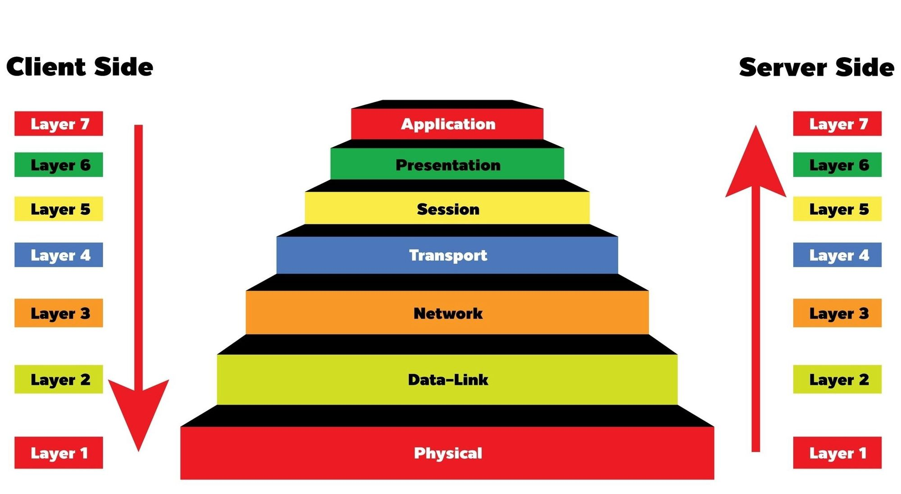
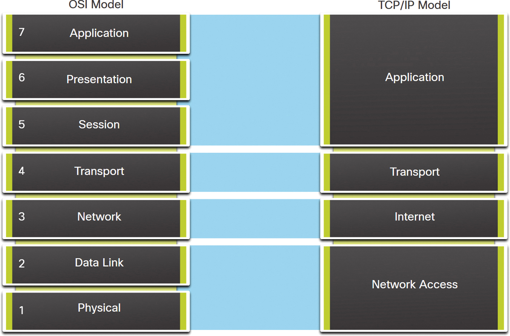
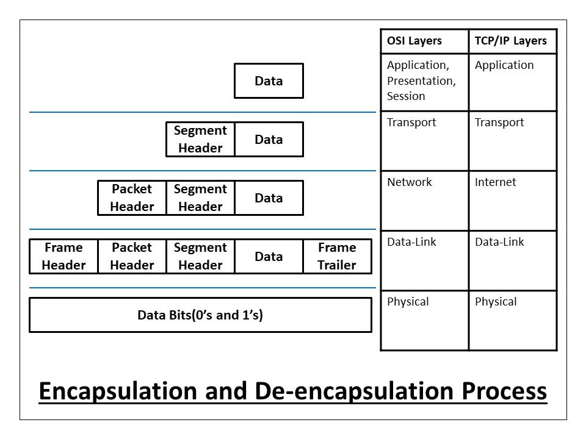

# OSI ve TCP/IP Protokol Modelleri

Bilgisayar ağlarında verilerin nasıl iletildiğini anlamak için, iki önemli referans modeli kullanılır: **OSI (Open Systems Interconnection)** modeli ve **TCP/IP (Transmission Control Protocol/Internet Protocol)** modeli. Bu modeller, farklı sistemlerin birbirleriyle uyumlu şekilde iletişim kurmalarını sağlayan bir çerçeve sunar.

---

## OSI Modeli

OSI modeli, ISO (International Organization for Standardization) tarafından geliştirilmiş 7 katmanlı bir ağ modelidir. Her katman belirli bir görevi yerine getirir ve diğer katmanlarla etkileşim hâlindedir.


### OSI Modeli Katmanları 


[[1]](#kaynakça)

#### 7. Uygulama Katmanı (Application Layer)

- **Kullanıcıya en yakın katmandır.**
- Ağ servislerini doğrudan son kullanıcı uygulamaları ile ilişkilendirir.
- Dosya transferi, e-posta, web tarayıcısı gibi uygulamalar bu katmanda çalışır.
- Verinin iletilmesi için iletişim partneri ile etkileşim kurar.
- Uygulamaların veriyi sunabileceği bir **arayüz sağlar**.

**Görevleri:**
- Ağ servislerini uygulamalara sunmak
- Kimlik doğrulama ve izin kontrolleri yapmak
- Protokol bağımsız veri sağlamak

**Protokol ve Servisler:**
- **HTTP (Web erişimi)**
- **FTP (Dosya transferi)**
- **SMTP (E-posta gönderimi)**
- **DNS (Alan adı çözümleme)**

**Örnek:**  
Bir tarayıcıda `www.example.com` adresini yazdığında, **HTTP protokolü** kullanılarak veri alışverişi yapılır.

---

#### 6. Sunum Katmanı (Presentation Layer)

- **Verinin temsilinden sorumludur.**
- İletilecek veriyi standart bir forma sokar veya alınan veriyi uygulamaya uygun hale getirir.
- Veriyi sıkıştırır, şifreler veya format dönüşümü yapar.

**Görevleri:**
- **Format çevirme:** (örneğin, EBCDIC ↔ ASCII)
- **Şifreleme ve şifre çözme:** (örneğin, TLS/SSL)
- **Sıkıştırma:** (veri boyutunu küçültme)

**Protokol ve Teknolojiler:**
- **TLS (Transport Layer Security)**
- **SSL (Secure Sockets Layer)**
- **JPEG, MPEG (Medya formatları)**

**Örnek:**  
Bir web sitesine HTTPS üzerinden bağlandığında, **TLS şifrelemesi** bu katmanda uygulanır.

---

#### 5. Oturum Katmanı (Session Layer)

- **İki uç sistem arasında oturum (session) başlatır, yönetir ve sonlandırır.**
- Uzun süreli ve sürekli veri alışverişi yapılacaksa oturumlar açılır.
- Bağlantıların **sıralamasını** ve **kontrolünü** sağlar.
- Bir oturum koparsa tekrar bağlanmayı veya veri transferini devam ettirmeyi sağlar.

**Görevleri:**
- Oturum kurulumu, yönetimi ve sonlandırılması
- Diyalog kontrolü (eş zamanlı/yarı eş zamanlı iletişim)
- Senkronizasyon (kontrol noktaları)

**Protokol ve Teknolojiler:**
- **NetBIOS**
- **RPC (Remote Procedure Call)**
- **PPTP (Point-to-Point Tunneling Protocol)**

**Örnek:**  
Bir uzaktan masaüstü oturumu açıldığında (örneğin RDP bağlantısı), **oturum katmanı** bu iletişimi yönetir.

---

#### 4. Taşıma Katmanı (Transport Layer)

- **Uçtan uca iletişim ve veri akışının güvenilirliğinden** sorumludur.
- Hata kontrolü, veri akışı kontrolü ve parçalama/birleştirme işlemleri bu katmanda yapılır.
- **TCP** gibi güvenilir, **UDP** gibi güvenilir olmayan protokoller kullanılır.

**Görevleri:**
- Bağlantı kurulumu ve sonlandırılması (TCP)
- Verinin parçalanması (segmentation) ve yeniden birleştirilmesi
- Hata kontrolü (yeniden gönderim mekanizmaları)
- Akış kontrolü (flow control)

**Protokol ve Servisler:**
- **TCP (Transmission Control Protocol)**: Güvenilir, bağlantı tabanlı
- **UDP (User Datagram Protocol)**: Hızlı, bağlantısız

**Örnek:**  
Bir web sitesine erişirken kullanılan **TCP protokolü**, veri kaybını önlemek için paketlerin başarılı iletimini garanti eder.

---

#### 3. Ağ Katmanı (Network Layer)

- **Verinin farklı ağlar arasında yönlendirilmesinden** sorumludur.
- Verilere **mantıksal adresler (IP adresleri)** ekler.
- Hedefe ulaşmak için en uygun yolun bulunmasını (routing) sağlar.
- Veri paketleri burada oluşturulur.

**Görevleri:**
- Mantıksal adresleme (IP adresi atama)
- Yönlendirme (router cihazları kullanarak)
- Hata bildirimleri ve teşhis (ICMP)

**Protokol ve Servisler:**
- **IP (Internet Protocol)**
- **ICMP (Internet Control Message Protocol)**
- **ARP (Address Resolution Protocol)**

**Örnek:**  
Bir bilgisayardan farklı bir ağa veri gönderilirken, **IP adresleri** kullanılarak **yönlendirme (routing)** yapılır.

---

#### 2. Veri Bağlantısı Katmanı (Data Link Layer)

- **Aynı ağ içerisindeki cihazlar arasında** veri iletiminden sorumludur.
- Fiziksel adresleme (MAC adresi) kullanır.
- Çerçeveleme (framing) yapar: Veriyi çerçeve (frame) haline getirir.
- Hatalı veri iletimini algılar ve düzeltir (örneğin CRC ile).

**Görevleri:**
- Fiziksel adresleme (MAC)
- Çerçeve oluşturma ve çözme
- Hata algılama ve düzeltme
- Akış kontrolü

**Protokol ve Teknolojiler:**
- **Ethernet**
- **Wi-Fi (IEEE 802.11)**
- **PPP (Point-to-Point Protocol)**

**Örnek:**  
Bir bilgisayar Ethernet üzerinden başka bir bilgisayara veri gönderdiğinde, **MAC adresleri** ile yönlendirme yapılır.

---

#### 1. Fiziksel Katman (Physical Layer)

- **Veriyi fiziksel ortamda (kablo, fiber, hava)** iletmekten sorumludur.
- Bitlerin elektriksel sinyaller, ışık darbeleri veya radyo dalgaları haline dönüşümünü sağlar.
- Kablolar, voltaj seviyeleri, konektörler, pin dizilimleri bu katmanın konusudur.

**Görevleri:**
- Bitlerin fiziksel iletimi
- Kablo türü ve sinyal şekli tanımlama
- Voltaj ve zamanlama standartlarının belirlenmesi

**Donanım ve Teknolojiler:**
- **Ethernet kabloları (RJ45)**
- **Fiber optik kablolar**
- **Wi-Fi sinyalleri**
- **Hub’lar, tekrarlayıcılar (repeater)**

**Örnek:**  
Bir Ethernet kablosu üzerinden sinyaller ile veri iletimi yapıldığında, bu fiziksel katmanın görev alanıdır.

---

## TCP/IP Modeli

TCP/IP modeli (ya da **İnternet Protokol Paketi**), internet üzerinde veri iletişimini sağlamak için geliştirilen ve **pratikte kullanılan gerçek modeldir**. **4 katmandan oluşur** ve OSI modelinin sadeleştirilmiş halidir.



[[2]](#kaynakça)

### TCP/IP Modeli Katmanları 

#### 1. Uygulama Katmanı (Application Layer)

- Kullanıcının ağ ile doğrudan etkileşime geçtiği katmandır.
- OSI modelindeki Uygulama, Sunum ve Oturum katmanlarının birleşimi gibidir.
- Verinin gösterimi, oturum yönetimi ve uygulama hizmetleri bu katmanda sağlanır.

#### Görevleri:
- Uygulamalar için ağ servislerini sunmak
- Dosya transferi, e-posta, web servisleri vb. iletişimi sağlamak
- İstemci-sunucu yapısında veri alışverişini düzenlemek

#### Protokoller:
- **HTTP / HTTPS** – Web erişimi
- **FTP / SFTP** – Dosya transferi
- **SMTP / POP3 / IMAP** – E-posta protokolleri
- **DNS** – Alan adı çözümleme
- **SNMP** – Ağ yönetim protokolü
- **SSH / Telnet** – Uzaktan oturum açma

#### Örnek:
- Tarayıcına `https://google.com` yazdığında HTTP veya HTTPS  kullanılarak uygulama katmanında bağlantı kurulur.

---

#### 2. Taşıma Katmanı (Transport Layer)

- Uçtan uca bağlantı kurulmasını ve verinin güvenli iletimini sağlar.
- OSI modelindeki **Taşıma (Transport)** katmanına karşılık gelir.
- Veri akışını kontrol eder, hata denetimi yapar, bağlantı güvenliğini sağlar.

#### Görevleri:
- Veriyi segmentlere ayırmak ve yeniden birleştirmek
- Akış kontrolü (flow control)
- Hata kontrolü (yeniden gönderim, onay)
- Bağlantı kurulumu ve sonlandırılması (TCP)

#### Protokoller:
- TCP (Transmission Control Protocol): 
  Bağlantı tabanlı, güvenilir veri aktarımı sağlar.  
  Paketlerin sıralı ve eksiksiz ulaşmasını garanti eder.
- UDP (User Datagram Protocol):  
  Bağlantısız ve hızlıdır. Hata kontrolü yoktur, ancak gecikmeye hassas uygulamalarda kullanılır.

#### Örnek:
- Web tarayıcıları, dosya transferi veya e-posta programları gibi uygulamalar TCP kullanırken; online oyunlar, VoIP uygulamaları veya canlı yayınlar UDP kullanır.

---

#### 3. İnternet Katmanı (Internet Layer)

- Verilerin kaynak ile hedef arasında yönlendirilmesini sağlar.
- OSI modelindeki **Ağ (Network)** katmanına karşılık gelir.
- IP adresleme, yönlendirme (routing), paketleme işlemleri burada gerçekleşir.

#### Görevleri:
- Mantıksal adresleme (IP adresleri)
- Paketleme (packet encapsulation)
- Yönlendirme (routing)
- Hata bildirimi (ICMP ile)

#### Protokoller:
- IP (Internet Protocol):
  - IPv4 ve IPv6 olmak üzere iki versiyonu vardır.
- ICMP (Internet Control Message Protocol):
  - Hata ve durum bildirimleri sağlar (örneğin: ping komutu)
- ARP (Address Resolution Protocol):
  - IP adresini MAC adresine çevirir
- RARP (Reverse ARP):
  - MAC adresinden IP adresi bulur

#### Örnek:
- Bir paketin Türkiye’den Almanya’daki sunucuya ulaşması için **IP yönlendirmesi (routing)** ve **adresleme** bu katmanda yapılır.

---

#### 4. Ağ Erişim Katmanı (Network Access Layer)  
(Ayrıca **Link Layer** veya **Host-to-Network Layer** olarak da bilinir)

- Verinin fiziksel olarak ağ üzerinden iletiminden sorumludur.
- OSI modelinin **Veri Bağlantısı (Layer 2)** ve **Fiziksel Katmanı (Layer 1)** ile eşdeğerdir.
- Bu katmanda donanım düzeyi iletişim sağlanır.

#### Görevleri:
- Fiziksel adresleme (MAC)
- Çerçeveleme (frame)
- Ortam erişim kontrolü (CSMA/CD gibi)
- Bit düzeyinde veri iletimi

#### Protokoller ve Teknolojiler:
- **Ethernet**
- **Wi-Fi (IEEE 802.11)**
- **PPP (Point-to-Point Protocol)**
- **Frame Relay**
- **MAC adresleme**

#### Donanım:
- Switch, NIC (Ağ kartı), Hub, Fiziksel kablolar (RJ45, fiber, coax)

#### Örnek:
- Bir Ethernet kablosu üzerinden veri gönderirken, çerçeveler fiziksel ortamdan geçer; bu işlemi ağ erişim katmanı yönetir.

---

## OSI ve TCP/IP Modellerinin Karşılaştırılması

| Özellik              | OSI Modeli                          | TCP/IP Modeli                     |
|----------------------|-------------------------------------|-----------------------------------|
| Katman Sayısı        | 7                                   | 4                                 |
| Geliştiren           | ISO                                 | DARPA / ABD Savunma Bakanlığı     |
| Kavramsal / Gerçek   | Daha çok teorik                     | Gerçek dünya uygulamalarına dayalı |
| Gelişmişlik Düzeyi   | Katmanlar daha ayrıntılı            | Daha bütünsel bir yapı            |
| Uyum                 | Uygulama bazlı uyum                 | İnternet protokolleriyle doğrudan uyumlu |

---

## Veri Kapsülleme Süreci

Veri ağ üzerinden gönderilirken her katman, önceki katmanın çıktısına kendi başlığını (header) ekler. Bu sürece **kapsülleme (encapsulation)** denir. Alıcı tarafında ise bu başlıklar katman katman çıkarılır (**decapsulation**).


### 🔶 1. Application Layer (Uygulama Katmanı)

#### Görevleri:
- Kullanıcı ile sistem arasında iletişimi sağlar.
- Veriyi üretir ve taşıma katmanına iletir.
- OSI modelindeki 3 katmanın birleşimi gibidir.

#### Örnek Protokoller:
- **HTTP, HTTPS, FTP, DNS, SMTP, DHCP, TELNET**

#### Ne eklenir?
- Uygulama katmanında **başlık eklenmez**.
- Uygulama, kendi protokol yapısına göre veri üretir.

#### Örnek Veri:
```text
GET /index.html HTTP/1.1
Host: www.example.com
```

---

### 🔶 2. Transport Layer (Taşıma Katmanı)

#### Görevleri:
- Uygulamalar arasında **uçtan uca bağlantı sağlar**.
- Veri akışını düzenler, hata kontrolü yapar, port numaraları belirler.
- **TCP (güvenilir)** ve **UDP (hızlı ama güvensiz)** protokolleri kullanılır.

#### Eklenen Bilgi: **TCP veya UDP Header**

| Alan             | Açıklama                               |
|------------------|----------------------------------------|
| Source Port      | Kaynak port numarası (ör: 49152)       |
| Destination Port | Hedef port numarası (ör: 80)           |
| Sequence Number  | Paket sırası (TCP için)                |
| Ack Number       | Karşı tarafın onayladığı son paket     |
| Flags            | TCP bağlantı kontrol (SYN, ACK, FIN)   |
| Window Size      | Akış kontrol penceresi                 |
| Checksum         | Hata kontrol değeri                    |

#### Veri Sonrası:
```text
[TCP Header][Uygulama Verisi]
```

---

### 🔶 3. Internet Layer (İnternet Katmanı)

#### Görevleri:
- **Kaynak ve hedef IP adresleri** ile cihazlar arasında yönlendirme yapar.
- IP adreslemesi ve fragmentasyonu sağlar.

#### Örnek Protokoller:
- **IPv4, IPv6, ICMP, ARP**

#### Eklenen Bilgi: **IP Header**

| Alan              | Açıklama                            |
|-------------------|-------------------------------------|
| Version           | IP sürümü (4 veya 6)                |
| Source IP         | Kaynak IP adresi                    |
| Destination IP    | Hedef IP adresi                     |
| TTL               | Time To Live (paket ömrü)           |
| Protocol          | Üst katmanın protokolü (TCP/UDP)   |
| Header Checksum   | IP başlık bütünlüğü kontrolü        |

#### Veri Sonrası:
```text
[IP Header][TCP Header][Uygulama Verisi]
```

---

### 🔶 4. Network Access Layer (Ağ Erişim Katmanı)

#### Görevleri:
- Fiziksel bağlantılar üzerinden veri aktarımı sağlar.
- **MAC adresleme**, **çerçeveleme**, **fiziksel sinyale çevirme** işlemlerini yapar.

#### Örnek Protokoller:
- **Ethernet, Wi-Fi (IEEE 802.11), PPP**

#### Eklenen Bilgi: **Ethernet Frame Header ve Trailer**

#### Ethernet Header:
| Alan               | Açıklama                        |
|--------------------|---------------------------------|
| Destination MAC    | Hedef fiziksel adres            |
| Source MAC         | Kaynak fiziksel adres           |
| Type/Length        | Hangi protokol taşınıyor?       |

#### Ethernet Trailer:
| Alan           | Açıklama                     |
|----------------|------------------------------|
| FCS            | Frame Check Sequence (CRC)   |

###  Sonuç Veri:
```text
[Ethernet Header][IP Header][TCP Header][Uygulama Verisi][FCS]
```

---


##  Decapsulation (Kapsülden Çıkarma) Nedir?

**Encapsulation** (kapsülleme) verinin gönderici cihazda oluşturulması ve her katmanda başlık eklenmesi iken,  
**Decapsulation** (kapsülden çıkarma) verinin alıcı cihazda katman katman analiz edilip, ilgili protokol başlıklarının çıkarılarak **kullanıcı verisinin** uygulamaya teslim edilmesidir.

Veri, TCP/IP modelinde **alt katmandan üst katmana doğru** (Network Access → Application) işlenir.

---

### 🔶 1. Network Access Layer (Ağ Erişim Katmanı)

- Alınan veri: Fiziksel ortamdan gelen bit dizileri.
- Bitler çerçeveye dönüştürülür.
- **Ethernet çerçevesi başlığı (MAC adresleri)** ve **FCS (Frame Check Sequence)** kontrol edilir.
- Eğer hedef MAC adresi bu cihaza aitse, çerçeve kabul edilir.
- FCS (CRC) ile hata kontrolü yapılır.

🧹 Bu katmanda **Ethernet header ve trailer çıkarılır**, **IP paketi** üst katmana iletilir.

---

### 🔶 2. Internet Layer (İnternet Katmanı)

- Alınan veri: **IP Paketi**
- **IP başlığı incelenir**:
  - Kaynak ve hedef IP adresleri okunur.
  - TTL değeri azaltılır (router’da yapılır).
  - Üst katmana hangi protokol (TCP/UDP) iletildiği belirlenir (`Protocol` alanı).
- Hedef IP, alıcı cihaza aitse işlem devam eder.

🧹 Bu katmanda **IP header çıkarılır**, **TCP/UDP segmenti** üst katmana iletilir.

---

### 🔶 3. Transport Layer (Taşıma Katmanı)

- Alınan veri: **TCP veya UDP segmenti**
- **Port numaraları incelenir**:
  - Destination Port → ilgili uygulamaya yönlendirilir.
  - Source Port → istemcinin bağlantı noktası olarak kullanılır.
- Gerekirse **sıralama, yeniden iletim, akış kontrolü, hata kontrolü** yapılır (TCP ise).

🧹 Bu katmanda **TCP/UDP header çıkarılır**, kalan **uygulama verisi** üst katmana iletilir.

---

### 🔶 4. Application Layer (Uygulama Katmanı)

- Alınan veri: **Uygulama verisi** (ör. HTTP isteği)
- Port numarasına göre gelen veri doğru uygulamaya (ör. web tarayıcısına, DNS sunucusuna) yönlendirilir.
- Protokole uygun şekilde analiz edilir (ör. HTTP başlıkları ayrılır).

🟢 **Sonuç**: Kullanıcı, web sayfasını görür veya uygulama gelen veriyi işler.



[[3]](#kaynakça)

---

## Kaynakça
[[1] OSI Model](https://www.mbtechtalker.com/what-is-the-osi-model/)

[[2] TCP/IP Model](https://www.ciscopress.com/articles/article.asp?p=3192417&seqNum=6)

[[3] Encapsulation-Decapsulation](https://afteracademy.com/blog/what-is-data-encapsulation-and-de-encapsulation-in-networking/)

[[4] Wikipedia - OSI model](https://en.wikipedia.org/wiki/OSI_model)

[[5] Wikipedia - TCP/IP model](https://en.wikipedia.org/wiki/Internet_protocol_suite)

[[6] Encapsulation-Decapsulation](https://www.omnisecu.com/tcpip/tcpip-encapsulation-decapsulation.php)