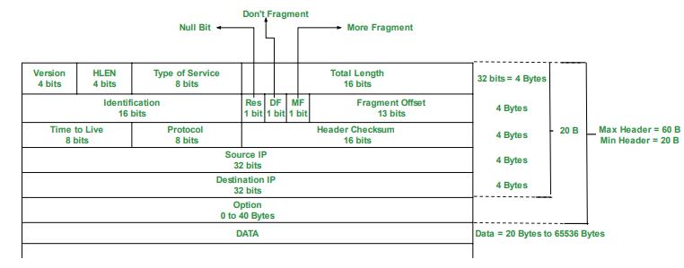

#  İnternet Protokolü (IP) 

##  IP Nedir?

**Internet Protocol (IP)**, verinin bir cihazdan başka bir cihaza yönlendirilmesini ve adreslenmesini sağlayan **katmansız, bağlantısız, güvenilir olmayan** bir ağ katmanı protokolüdür. IP, **TCP/IP protokol kümesinin temel protokolüdür** ve genellikle **3. katman (Ağ Katmanı)** olarak sınıflandırılır.

##  IP Protokolünün Görevleri 

| Görev | Ne işe yarar? |
|-------|----------------|
| Adresleme | Cihazlara adres verir |
| Yönlendirme | Veriyi doğru yoldan gönderir |
| Paketleme | Veriyi kutuya (pakete) koyar |
| Parçalama | Büyük verileri bölerek yollar |
| TTL | Paketin çok dolaşmasını engeller |
| Protokol tanımı | Verinin ne olduğunu belirtir |
| Hata kontrolü | Paket sağlam mı kontrol eder |
| Bağlantısız gönderim | Önceden bağlantı kurmadan gönderir |

### 1. Adres Verme (IP Adresi)

Her cihazın bir IP adresi vardır. Bu, internetteki bir "adres" gibidir.

Örnek:  
Senin IP adresin “192.168.1.5” ise, sana gelen veri bu adrese gönderilir.  
Tıpkı bir kargonun senin ev adresine gelmesi gibi.

### 2. Yön Göstermek (Yönlendirme)

Veri, gönderildiği anda hedefe hemen ulaşmaz. Arada birçok cihaz (router) vardır. IP, verinin bu cihazlar üzerinden **doğru yolda ilerlemesini sağlar**.

Örnek:  
Sen Ankara’dan İstanbul’a mektup gönderiyorsun. Mektup, aradaki şehirlerden geçerek İstanbul’a varıyor. IP de bu güzergâhı belirliyor.

### 3. Veriyi Paket Yapmak

Bilgisayarlar veriyi küçük parçalara bölerek gönderir. Bu parçalara **IP paketi** denir. IP, her parçanın içine gönderici ve alıcı adreslerini koyar.

### 4. Büyük Veriyi Parçalama

Eğer veri çok büyükse (örneğin bir resim dosyası), IP onu parçalara ayırır. Sonra bu parçalar sırayla gönderilir. Alıcı bu parçaları tekrar birleştirir.

### 5. Paketlerin Ömrünü Belirleme (TTL)

Bir veri paketi, yanlış yöne giderse sonsuza kadar dolaşmasın diye IP ona bir “ömür” verir. Bu süre dolunca paket silinir.

### 6. Üst Protokolü Belirtmek

IP, taşıdığı verinin içinde ne olduğunu da belirtir: Bu bir web verisi mi? Mail mi? Ses mi?  
Yani üst katmandaki protokolü gösterir (örneğin TCP ya da UDP).

### 7. Hata Kontrolü

IP paketi gönderilirken bozulmuş olabilir. IP, paket başlığını kontrol eder. Eğer bozuksa paketi iptal eder.

### 8. Bağlantı Kurmadan Gönderim

IP, veri göndermek için önceden bağlantı kurmaz.  
Veriyi gönderir ve gerisine karışmaz.


##  IPv4 (Internet Protocol version 4)

IPv4 adres yapısı, TCP/IP protokol ailesinde cihazların ağ üzerinde tanımlanmasını sağlayan **32 bitlik** bir adresleme sistemidir. Bu adresleme, cihazların birbirleriyle haberleşmesini mümkün kılar. 


###  IPv4 Adresinin Temel Özellikleri

- **Uzunluk:** 32 bit (4 byte)
- **Gösterimi:** Noktalarla ayrılmış dört sekizlik (oktetten) oluşur.
- **Biçim:** `xxx.xxx.xxx.xxx` (örneğin: `192.168.1.1`)
- **Her oktet değeri:** 0 – 255 arasında bir değerdir.
- **Toplam adres sayısı:** 2³² = **4.294.967.296 adet** IPv4 adresi.

IPv4 adresleri, insan tarafından okunabilir olması için 8 bitlik 4 blok hâlinde, **ondalık sayılarla** gösterilir:

| 8 bit | 8 bit | 8 bit | 8 bit |
|-------|-------|-------|-------|
| 192   | 168   | 1     | 10    |

Bu adresin ikili (binary) karşılığı:

`11000000.10101000.00000001.00001010`


### IPv4 Adresi Nasıl Oluşur?

IPv4 adresi iki temel bileşenden oluşur:

- ### 1. Ağ (Network) Kısmı
    - Cihazın bağlı olduğu ağı temsil eder.
    - Yönlendiriciler, bu kısmı kullanarak paketleri doğru ağa gönderir.

- ### 2. Host (Cihaz) Kısmı
    - Aynı ağdaki cihazları birbirinden ayırır.
    - Aynı ağ üzerindeki her cihazın host kısmı farklı olmalıdır.

Bu ayrım, **subnet maskesi (alt ağ maskesi)** sayesinde belirlenir.


Örnek bir ip adresinin host ve ağ kısımları

IP Adresi: `192.168.10.25`\
Alt Ağ Maskesi (Subnet Mask):`255.255.255.0`\
CIDR Gösterimi: `/24`

Subnet maskesi `/24` olduğu için ilk **24 bit** (ilk 3 oktet) ağ kısmıdır, kalan **8 bit** (son oktet) host kısmıdır:

```
IP Adresi (binary):     11000000.10101000.00001010.00011001
                         [ ağ ]   [ ağ ]   [ ağ ]  [ host ]
                          (192)    (168)    (10)     (25)
```


```
IP Adresi : 192.168.10.25

|   Ağ Kısmı   |   Host Kısmı |
| 192.168.10   |      25      |
```

##  IPv4 Sınıfları (Classful Addressing)

IPv4 adresleri ilk başlarda **sınıflı (classful)** yapıya göre ayrılmıştı. Bu sistemde, adresler ilk birkaç bitten hangi sınıfa ait olduklarını belli eder.

| Sınıf | Başlangıç Biti | Aralık               | Ağ / Host Yapısı              | Kullanım                     |
|-------|----------------|----------------------|-------------------------------|------------------------------|
| A     | 0              | 1.0.0.0 – 126.255.255.255 | 8 bit ağ / 24 bit host        | Büyük ağlar                  |
| B     | 10             | 128.0.0.0 – 191.255.255.255 | 16 bit ağ / 16 bit host       | Orta ölçekli ağlar           |
| C     | 110            | 192.0.0.0 – 223.255.255.255 | 24 bit ağ / 8 bit host        | Küçük ağlar                  |
| D     | 1110           | 224.0.0.0 – 239.255.255.255 | Multicast adresler            | Multimedya yayınları         |
| E     | 1111           | 240.0.0.0 – 255.255.255.255 | Deneysel (kullanılamaz)       | Deneysel                     |

> **Not:** Sınıflı yapı günümüzde terk edilmiş, yerine **CIDR (Classless Inter-Domain Routing)** sistemi gelmiştir.


##  IPv4 Adres Türleri

###  1. **Genel (Public) Adresler**
- İnternette kullanılan, yönlendirilebilir adreslerdir.
- Örneğin: `8.8.8.8`

###  2. **Özel (Private) Adresler**
- Yerel ağlarda kullanılır, internete doğrudan çıkamaz.
- NAT (Network Address Translation) ile internete açılır.
- Özel adres aralıkları:
  - **Class A:** `10.0.0.0 – 10.255.255.255` (/8)
  - **Class B:** `172.16.0.0 – 172.31.255.255` (/12)
  - **Class C:** `192.168.0.0 – 192.168.255.255` (/16)

###  3. **Loopback Adresi**
- `127.0.0.0/8` aralığı (en yaygın: `127.0.0.1`)
- Cihazın kendisini test etmek için kullanılır.

###  4. **Broadcast Adresi**
- Aynı ağdaki tüm cihazlara paket göndermek için kullanılır.
- Örnek: `192.168.1.255` (eğer subnet maskesi /24 ise)

###  5. **Ağ (Network) Adresi**
- Alt ağın başlangıç adresidir. Hostlara atanmaz.
- Örnek: `192.168.1.0` (eğer subnet maskesi /24 ise)


##  Örnek: IPv4 Adres Analizi

- **IP adresi:** `192.168.10.25`
- **Subnet Mask:** `255.255.255.0` (/24)

| Tür          | Değer             |
|--------------|-------------------|
| Ağ Adresi    | 192.168.10.0      |
| İlk Host     | 192.168.10.1      |
| Son Host     | 192.168.10.254    |
| Yayın Adresi | 192.168.10.255    |
| Toplam Host  | 254 (2⁸ - 2, çünkü ağ ve broadcast adresi kullanılamaz)         |


##  CIDR (Classless Inter-Domain Routing)

CIDR, ağları daha esnek bir şekilde bölebilmek için geliştirilmiştir. Sınıflı yapının aksine her IP adresine `/` ile bit uzunluğu eklenir.

Örnek:
- `192.168.1.0/24` → 256 adreslik ağ
- `192.168.1.0/25` → 128 adreslik ağ
- `192.168.1.0/30` → 4 adreslik ağ (2 kullanılabilir host)

### 1. Subnetting Nedir?

**Subnetting (Alt Ağlara Bölme)**, büyük bir IP ağı bloğunu daha küçük parçalara (alt ağlara) ayırma işlemidir.

Neden Yapılır?

- IP adreslerini verimli kullanmak
- Ağ trafiğini yönetmek
- Güvenlik ve organizasyon sağlamak
- Yayın (broadcast) trafiğini azaltmak

### 2. Subnet Maskesi ve CIDR Notasyonu

#### Subnet Maskeleri:

| CIDR | Subnet Maskesi  | Host Sayısı |
| ---- | --------------- | ----------- |
| /8   | 255.0.0.0       | 16,777,214  |
| /16  | 255.255.0.0     | 65,534      |
| /24  | 255.255.255.0   | 254         |
| /25  | 255.255.255.128 | 126         |
| /26  | 255.255.255.192 | 62          |
| /27  | 255.255.255.224 | 30          |
| /28  | 255.255.255.240 | 14          |
| /29  | 255.255.255.248 | 6           |
| /30  | 255.255.255.252 | 2           |

**Not:** Her subnet’te 2 IP kullanılamaz:

1. Ağ adresi
2. Yayın adresi

### 3. Örnekle Anlatım: 192.168.1.0/24 Ağı

Bu ağda toplam 256 IP adresi vardır:

```
192.168.1.0 – 192.168.1.255
```

- Ağ adresi: 192.168.1.0
- Yayın adresi: 192.168.1.255
- Kullanılabilir cihaz sayısı: **254 (256 - 2)**

#### 4’e Bölme Örneği (Her alt ağda 64 IP olsun)

Bu durumda CIDR değeri: **/26**

**/26 = 255.255.255.192** (64 adres)

| Alt Ağ | Aralık           | Host Aralığı                  | Yayın Adresi  |
| ------ | ---------------- | ----------------------------- | ------------- |
| 1. Ağ  | 192.168.1.0/26   | 192.168.1.1 – 192.168.1.62    | 192.168.1.63  |
| 2. Ağ  | 192.168.1.64/26  | 192.168.1.65 – 192.168.1.126  | 192.168.1.127 |
| 3. Ağ  | 192.168.1.128/26 | 192.168.1.129 – 192.168.1.190 | 192.168.1.191 |
| 4. Ağ  | 192.168.1.192/26 | 192.168.1.193 – 192.168.1.254 | 192.168.1.255 |

### 4. Subnetting Hesaplama (Adım Adım)

Örnek: **192.168.10.0/24 ağını**, 6 alt ağa bölelim.

#### Adım 1: Kaç bit gerekir?

6 alt ağ için **en az 3 bit** gerekir. Çünkü:

- 2³ = 8 (en az 6'yı karşılar)

CIDR: /24 + 3 = **/27**\
Subnet Mask: 255.255.255.224\
Her subnet'te:

- 32 IP (2⁵)
- 30 kullanılabilir host (32 – 2)

### 5. Farklı Subnet İhtiyacı Olan Durumlar (VLSM)

VLSM (**Variable Length Subnet Mask**) ile her ağa farklı büyüklükte subnet verebiliriz.

Örneğin:

| Bölüm | Host İhtiyacı | En Yakın CIDR  |
| ----- | ------------- | -------------- |
| A     | 100           | /25 (126 host) |
| B     | 50            | /26 (62 host)  |
| C     | 20            | /27 (30 host)  |
| D     | 10            | /28 (14 host)  |

Bu yöntem adres israfını önler.


### 6. Subnetting Uygulaması

Verilen: **Ağ: 10.0.0.0/8**, Amaç: Her biri 500 host destekleyen alt ağlar oluştur.

#### 1. 500 host için kaç bit?

- 2⁹ = 512 → /8 + (32 - 9) = **/23**

#### 2. Subnet maskesi:

- **255.255.254.0**

#### 3. Her subnet:

- 512 adres, 510 kullanılabilir host

İlk birkaç subnet:

| Alt Ağ | Aralık      | Kullanılabilir IP Aralığı |
| ------ | ----------- | ------------------------- |
| 1      | 10.0.0.0/23 | 10.0.0.1 – 10.0.1.254     |
| 2      | 10.0.2.0/23 | 10.0.2.1 – 10.0.3.254     |
| 3      | 10.0.4.0/23 | 10.0.4.1 – 10.0.5.254     |


##  IPv4 Adresinin Sınırlamaları

- **Adres yetersizliği:** 4 milyar adres, günümüz için yetersiz kaldı.
- **NAT ihtiyacı:** Aynı IP’yi birden fazla kişi kullanmak için NAT gerekiyor.
- **IPv6’ya geçiş:** Bu sınırlamalar IPv6 protokolünün geliştirilmesini sağladı.


## IPv4 Datagramı (IP Paketi) Nedir?

Bir **IP datagramı**, verinin bir noktadan başka bir noktaya yönlendirilebilmesi için IPv4 tarafından oluşturulan **tamamlanmış veri yapısıdır**. Datagram iki ana bölümden oluşur:

1. **IP Header (Başlık)** – kontrol bilgilerini içerir (en az 20 byte)
2. **Data (Veri)** – taşınan gerçek yük (payload), örneğin TCP/UDP segmenti


### 1. **IP Header** (Minimum 20 byte)

Bu başlık; yönlendirme, parçalama, hata denetimi gibi işlemler için gerekli tüm bilgileri içerir. Aşağıda her alan ayrıntılı şekilde açıklanmıştır.

| Alan                             | Uzunluk  | Açıklama                                                                                                          |
| -------------------------------- | -------- | ----------------------------------------------------------------------------------------------------------------- |
| **Version**                      | 4 bit    | IP sürümü – IPv4 için **4**                                                                                       |
| **IHL (Internet Header Length)** | 4 bit    | Başlığın uzunluğu. Minimum değer 5 (5×32 = 160 bit = 20 byte).                                                    |
| **Type of Service (ToS) / DSCP** | 8 bit    | QoS için öncelik belirler. Modern kullanımı DSCP ve ECN (Explicit Congestion Notification) şeklindedir.           |
| **Total Length**                 | 16 bit   | Datagramın tamamının uzunluğu (header + data). Maksimum 65,535 byte.                                              |
| **Identification**               | 16 bit   | Aynı datagramın parçaları için ortak kimlik.                                                                      |
| **Flags**                        | 3 bit    | Paket parçalanma durumunu belirtir.  - Bit 0: rezerve  - Bit 1: DF (Don't Fragment)  - Bit 2: MF (More Fragments) |
| **Fragment Offset**              | 13 bit   | Parçalanmış verinin orijinal datadaki konumunu belirtir. 8-byte birimlerle hesaplanır.                            |
| **Time to Live (TTL)**           | 8 bit    | Paket yönlendiriciler arasında dolaştıkça bu değer azalır. 0 olduğunda atılır.                                    |
| **Protocol**                     | 8 bit    | Üst katman protokolünü belirtir: TCP (6), UDP (17), ICMP (1) gibi.                                                |
| **Header Checksum**              | 16 bit   | Yalnızca başlığın doğruluğunu denetler.                                                                           |
| **Source IP Address**            | 32 bit   | Gönderen cihazın IP adresi                                                                                        |
| **Destination IP Address**       | 32 bit   | Hedef cihazın IP adresi                                                                                           |
| **Options (Opsiyonel)**          | Değişken | Genelde kullanılmaz. Özel işler için (örneğin, yön belirleme).                                                    |
| **Padding**                      | Değişken | Header’ın 32-bit’e bölünebilmesi için doldurulur.                                                                 |

---

### 2. **Data (Payload)**

Bu alan, taşıdığı gerçek bilgidir. Yukarıdaki başlık tarafından yönlendirilir ve korunur.

Taşınan veri genellikle:

- TCP segmenti (örneğin HTTP trafiği)
- UDP datagramı (örneğin DNS)
- ICMP mesajı (örneğin ping)




## Datagram’ın İnternetteki Yolculuğu

1. **Host** (bilgisayar) bir uygulama verisini TCP üzerinden gönderir.
2. **TCP**, veriyi segmente çevirir ve IP’ye iletir.
3. **IP**, datagramı oluşturur, header ekler.
4. **Veri Link Katmanı** (örneğin Ethernet), IP datagramını alıp çerçeveye sarar.
5. **Yönlendiriciler**, IP header içindeki hedef IP’ye göre yönlendirir.
6. **Hedef**, paketi aldığında IP header'ı soyup, TCP segmenti veya ICMP mesajı gibi veriyi üst katmana iletir.


## 🔹 IP ile Veri Gönderim Türleri

### 🟩 Unicast
- Tek cihaza veri gönderilir.
- IP adresi tek bir hedefe yöneliktir.

### 🟦 Broadcast
- Aynı ağdaki tüm cihazlara veri gönderilir.
- IPv4'te hedef adres: `255.255.255.255`

### 🟪 Multicast
- Belirli bir gruba veri gönderilir.
- IPv4 Multicast aralığı: `224.0.0.0 – 239.255.255.255`
- Örn: IPTV, video konferans

---

## 🔹 IP Paketinin Yolculuğu

1. Host veriyi TCP/UDP ile bölüştürür.
2. IP katmanı bu veriyi paketler, hedef IP adresini ekler.
3. IP paketi, MAC adresi ile birlikte Ethernet üzerinden gönderilir.
4. Router’lar IP başlığına bakarak yönlendirir.
5. Hedefe ulaştığında, üst katmana iletilir.

## Kaynakça

- [IP Datagram – GeeksforGeeks](https://www.geeksforgeeks.org/introduction-and-ipv4-datagram-header/)
- [Internet Protocol – GeeksforGeeks](https://www.geeksforgeeks.org/what-is-internet-protocol-ip/)
- [Internet Protocol – Wikipedia (TR)](https://tr.wikipedia.org/wiki/Internet_Protocol)
- [Introduction of Classful IP Addressing – GeeksforGeeks](https://www.geeksforgeeks.org/introduction-of-classful-ip-addressing/)
- [Cisco Networking Academy – CCNA: Introduction to Networks v7.0 Curriculum](https://www.netacad.com)
- *Kurose, James F., and Keith W. Ross.* Computer Networking: A Top-Down Approach. 8th Edition, Pearson, 2020.
- *Forouzan, Behrouz A.* Data Communications and Networking. 5th Edition, McGraw-Hill, 2013.
- [RFC 791 – Internet Protocol (IETF)](https://tools.ietf.org/html/rfc791)
- [Microsoft Learn – IP Addressing and Subnetting](https://learn.microsoft.com/en-us/windows-server/networking/technologies/ipam/ipam-top)
- [Cloudflare Learning Center – What is an IP Address?](https://www.cloudflare.com/learning/ddos/glossary/internet-protocol/)


