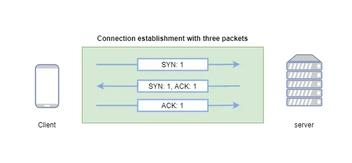
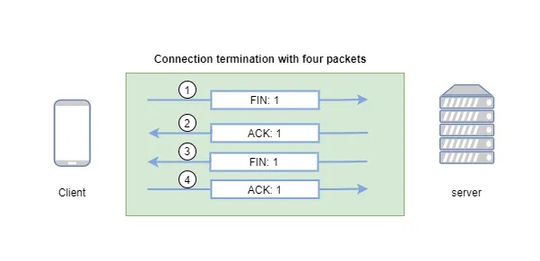
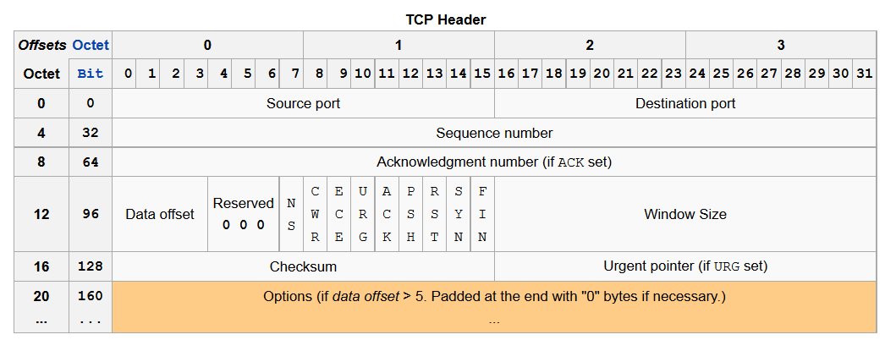

# TCP UDP 

## **Taşıma Katmanı (Transport Layer)**

Taşıma katmanı, bilgisayar ağlarının katmanlı mimarilerinde uygulama katmanı ile ağ katmanı arasında yer alan ve verinin bir uçtan diğer uca güvenli, düzgün ve doğru sırayla iletilmesini sağlayan katmandır. Temel görevi, verinin kaynak bilgisayardaki uygulamadan hedef bilgisayardaki doğru uygulamaya ulaştırılmasını sağlamaktır.

Bu katman, üst katmanlardan (örneğin uygulama katmanı) gelen verileri alır, bunları uygun şekilde parçalara ayırır (segmentlere dönüştürür), numaralandırır, hata kontrol bilgileri ekler ve alt katmanlara iletir. Ayrıca, karşı uçtan gelen verilerin doğruluğunu kontrol eder, eksik veya bozulmuş verilerin yeniden gönderilmesini talep edebilir. Böylece veri iletiminin güvenilirliği ve bütünlüğü sağlanmış olur.

### **Taşıma Katmanının TCP/IP Modelindeki Yeri**

TCP/IP modelinde taşıma katmanı, dört katmandan oluşan modelin üçüncü katmanıdır. Katman sıralaması şu şekildedir:

1. Uygulama Katmanı (Application Layer)
2. Taşıma Katmanı (Transport Layer)
3. İnternet Katmanı (Internet Layer)
4. Ağ Erişim Katmanı (Network Access Layer)

Taşıma katmanı, uygulama katmanındaki protokoller (HTTP, FTP, SMTP vb.) ile internet katmanındaki protokoller (IP gibi) arasında köprü görevi görür. Bu katmanda en yaygın olarak kullanılan protokoller TCP (Transmission Control Protocol) ve UDP (User Datagram Protocol) protokolleridir.

### **Taşıma Katmanının Görevleri**

Taşıma katmanının temel görevleri şunlardır:

1. **Uçtan Uca İletişim (End-to-End Communication):**
   Veri, kaynak sistemdeki bir uygulamadan hedef sistemdeki doğru uygulamaya yönlendirilir. Uygulamalar arasında doğrudan bağlantı kurulmasını sağlar.

2. **Segmentasyon ve Yeniden Birleştirme:**
   Üst katmanlardan gelen büyük veri blokları segment adı verilen daha küçük parçalara bölünür. Bu segmentler hedefte tekrar birleştirilir.

3. **Port Numaralandırması:**
   Her uygulamaya özgü bir port numarası vererek birden fazla uygulamanın aynı anda iletişim kurmasına olanak tanır.

4. **Hata Kontrolü:**
   Verinin iletim sırasında bozulup bozulmadığını kontrol etmek için hata tespit mekanizmaları (örneğin checksum) kullanılır.

5. **Akış Kontrolü:**
   Alıcının kapasitesini aşmayacak şekilde veri gönderimini düzenler. Bu sayede tampon taşmaları önlenir.

6. **Bağlantı Kurulumu ve Sonlandırma (sadece TCP):**
   İletişim başlamadan önce üç yönlü el sıkışma (3-way handshake) ile bağlantı kurulur ve iş bittiğinde bağlantı güvenli şekilde sonlandırılır.

7. **Güvenilirlik (sadece TCP):**
   Kaybolan segmentlerin yeniden gönderilmesi, sıralama, tekrar iletim gibi işlemlerle verinin doğru ulaştırılması sağlanır.

### **Port Kavramı ve Port Numaraları**

**Port**, bir bilgisayar sisteminde aynı anda çalışan farklı uygulamaları ayırt etmeye yarayan sayısal tanımlayıcıdır. Taşıma katmanı, veriyi hangi uygulamanın alacağını belirlemek için port numaralarını kullanır. Böylece birden fazla uygulama aynı anda aynı ağ bağlantısını kullanabilir.

Port numaraları, 16 bitlik sayılardır ve **0 ile 65535** arasında değer alabilir. Bu numaralar üç kategoriye ayrılır:

1. **İyi Bilinen Portlar (Well-Known Ports: 0–1023):**
   Yaygın servisler için ayrılmıştır. Örnekler:

   * HTTP → 80
   * HTTPS → 443
   * FTP → 21
   * SSH → 22
   * DNS → 53

2. **Kayıtlı Portlar (Registered Ports: 1024–49151):**
   Özel uygulamalar ve yazılım üreticileri tarafından kayıt edilerek kullanılan portlardır.

3. **Dinamik/Özel Portlar (Dynamic/Private Ports: 49152–65535):**
   Genellikle istemci tarafında geçici olarak kullanılır. Örneğin, bir web sayfası istenildiğinde istemci geçici olarak bu aralıktaki bir portu kullanabilir.

Taşıma katmanında **TCP ve UDP başlıkları** içinde bu port numaraları yer alır. Veri paketinde hem kaynak port numarası (veriyi gönderen uygulama) hem de hedef port numarası (verinin ulaşacağı uygulama) belirtilir.

## **TCP (Transmission Control Protocol) Nedir?**

TCP (Transmission Control Protocol), taşıma katmanında çalışan bağlantı tabanlı bir protokoldür ve internet üzerindeki en yaygın protokollerden biridir. TCP’nin temel amacı, iki cihaz arasında güvenilir, sıralı ve hatasız veri iletimi sağlamaktır.

TCP, veriyi segmentlere böler, her bir segmenti numaralandırır, gönderilen verilerin ulaşıp ulaşmadığını kontrol eder ve kaybolan segmentleri tekrar gönderir. Böylece uygulama katmanındaki programlar, altta yatan bağlantının güvensizliğinden etkilenmeden veri alışverişi yapabilir. TCP, özellikle e-posta, web (HTTP/HTTPS), dosya aktarımı (FTP) gibi güvenilirliğin ön planda olduğu uygulamalarda kullanılır.

### **TCP Özellikleri**

1. **Bağlantı Tabanlı (Connection-Oriented):**
   Veri iletiminden önce iki uç arasında bağlantı kurulur, iletişim tamamlandıktan sonra bağlantı sonlandırılır.

2. **Güvenilir İletim:**
   Her segment için onay (ACK) alınır, kaybolan segmentler tekrar gönderilir.

3. **Veri Sıralama:**
   Segmentler hedefe farklı sırayla ulaşsa bile TCP bunları doğru sıraya koyar.

4. **Akış Kontrolü (Flow Control):**
   Alıcının tampon kapasitesine göre gönderici veri hızını ayarlar. Bu sayede tampon taşmaları önlenir.

5. **Tıkanıklık Kontrolü (Congestion Control):**
   Ağda tıkanıklık olup olmadığını algılar ve veri gönderim hızını buna göre ayarlar.

6. **Tam Çift Yönlü İletişim (Full Duplex):**
   Aynı anda her iki yönde veri iletimi mümkündür.

7. **Hata Kontrolü:**
   TCP başlığı içinde yer alan checksum ile verinin bozulup bozulmadığı kontrol edilir.

### **TCP Bağlantı Kurma Süreci (3-Way Handshake)**

TCP bağlantısı, üç aşamalı bir el sıkışma süreci ile kurulur. Bu sürece **3-Way Handshake** adı verilir. Amaç, her iki tarafın da veri alışverişine hazır olduğunu karşılıklı olarak teyit etmektir.

**Adımlar:**

1. **SYN:**
   İstemci, bağlantı isteği gönderir. TCP segmentinde SYN (synchronize) bayrağı set edilir ve istemcinin başlangıç sıra numarası (ISN) belirtilir.

2. **SYN-ACK:**
   Sunucu, gelen SYN mesajını onaylar (ACK) ve kendi SYN mesajını gönderir. Bu mesajda hem ACK hem de SYN bayrakları set edilmiştir.

3. **ACK:**
   İstemci, sunucunun SYN mesajını onaylar ve ACK bayrağını set ederek bağlantıyı kurar.

Bağlantı kurulduktan sonra veri iletimi başlar.

[[1]](#kaynakça)

### **TCP Bağlantı Sonlandırma Süreci (4-Way Termination)**

TCP bağlantısı, dört adımlı bir süreçle sonlandırılır. Bu sürece **4-Way Termination** adı verilir. Her iki taraf da bağımsız olarak veri iletimini sonlandırabilir.

**Adımlar:**

1. **FIN:**
   Bağlantıyı kapatmak isteyen taraf (örneğin istemci) FIN (finish) bayrağı set edilmiş bir segment gönderir.

2. **ACK:**
   Karşı taraf (örneğin sunucu) gelen FIN segmentini onaylar ve ACK bayrağını set eder. Bu noktada bağlantı tek yönlü olarak kapanmıştır.

3. **FIN:**
   Karşı taraf da kendi veri iletimini sonlandırmak isterse FIN bayrağını set ederek segment gönderir.

4. **ACK:**
   İlk taraf, gelen FIN mesajını onaylar ve ACK gönderir. Bu son segment ile her iki taraf da bağlantıyı tamamen kapatmış olur.

Son ACK segmenti gönderildikten sonra kısa bir süre (genellikle 2\*MSL: Maximum Segment Lifetime) beklenir, ardından bağlantı tamamen sonlandırılır.

 

[[1]](#kaynakça)

### **TCP Başlık Yapısı (Header Structure)**

TCP başlığı, bir TCP segmentinin başlangıç kısmında yer alır ve bağlantı kontrolü, veri bütünlüğü, sıralama ve hata düzeltme gibi birçok görevin yerine getirilmesini sağlar. 20 bayttan başlar, opsiyonel alanlarla birlikte 60 bayta kadar çıkabilir. Şimdi TCP header’ını alan alan detaylı olarak inceleyelim:

[[2]](#kaynakça)

#### 1. **Source Port (16 bit)**

* Veriyi gönderen uygulamanın port numarasıdır.
* Örnek: Web tarayıcınız 49152 gibi rastgele bir porttan çıkış yapar.

---

#### 2. **Destination Port (16 bit)**

* Verinin ulaşacağı uygulamanın port numarasıdır.
* Örnek: HTTP için 80, HTTPS için 443, SSH için 22.

---

#### 3. **Sequence Number (32 bit)**

* Gönderilen ilk baytın sıra numarasıdır.
* **Bağlantı kurma sırasında (SYN setliyken)** rastgele başlatılır.
* Alıcı bu numarayı kullanarak doğru sırada veri alır.

---

#### 4. **Acknowledgment Number (32 bit)**

* **ACK biti setli ise geçerlidir**.
* Karşı tarafın bir sonraki beklediği baytın sıra numarasıdır.
* Yani "şu ana kadar şu numaraya kadar aldım, devamını bekliyorum" demek.

---

#### 5. **Data Offset (4 bit)**

* TCP başlığının **kaç 32-bit'lik kelimeden oluştuğunu** belirtir.
* Yani başlığın **kaç bayt olduğunu** gösterir (çarpı 4 ile hesaplanır).
* Minimum değeri 5’tir (5 × 4 = 20 byte, opsiyonsuz TCP başlığı).

---

#### 6. **Reserved (3 bit)**

* Gelecekte kullanım için ayrılmıştır. Şu an kullanılmaz, 0’dır.

---

#### 7. **Flags (9 bit toplam)**

TCP kontrol bayrakları:

| Bayrak  | Açıklama                                              |
| ------- | ----------------------------------------------------- |
| **NS**  | ECN gizliliği için kullanılır (Nokta).                |
| **CWR** | Tıkanıklık kontrolü (Congestion Window Reduced).      |
| **ECE** | ECN ile tıkanıklık algılandığında bildirim yapılır.   |
| **URG** | Urgent Pointer geçerli (öncelikli veri var).          |
| **ACK** | Acknowledgment Number geçerli.                        |
| **PSH** | Push Function: Veriyi uygulamaya hemen ilet.          |
| **RST** | Bağlantıyı sıfırla.                                   |
| **SYN** | Bağlantı başlatılır (üç yönlü el sıkışma başlangıcı). |
| **FIN** | Bağlantı sonlandırılır.                               |

---

#### 8. **Window Size (16 bit)**

* Alıcının şu anda kabul edebileceği **veri miktarını bayt cinsinden** gösterir (akış kontrolü).

---

#### 9. **Checksum (16 bit)**

* TCP başlığının ve verinin **hatalı iletilip iletilmediğini** denetler.
* Hem başlık hem de veri üzerinde çalışır. Pseudo-header ile birlikte hesaplanır.

---

#### 10. **Urgent Pointer (16 bit)**

* URG bayrağı aktifse kullanılır.
* "Acil veri"nin bittiği yeri gösterir.
* Örneğin telnet gibi uygulamalarda bazı kontrol karakterleri için kullanılır.

---

#### 11. **Options (0–40 bayt arası)**

* TCP’nin opsiyonel özelliklerini içerir.
* Örnekler:

  * **MSS (Maximum Segment Size)**: Maksimum veri boyutu.
  * **Window Scaling**: Pencere boyutunu büyütme.
  * **Timestamps**: Gecikme ölçümü ve segment sıralaması.
* Bu alan başlığın uzunluğunu artırabilir.bilirim. Bu header'ı daha iyi anlamana yardımcı olur. Göndermemi ister misin?

### **TCP Akış Kontrolü (Flow Control) ve Pencere Boyutu (Window Size)**

Akış kontrolü, **veri göndericisinin, alıcının tamponunu taşırmadan veri göndermesini sağlayan bir mekanizmadır**. Bu, alıcının işlem kapasitesiyle uyumlu şekilde veri akışının ayarlanmasına olanak tanır.

####  **Temel Mekanizma: Sliding Window (Kayan Pencere)**

TCP’de kullanılan akış kontrol yöntemi **“sliding window” (kayan pencere)** mekanizmasıdır. Alıcı, alabileceği kadar veri miktarını **Window Size** alanıyla göndericiye bildirir. Gönderici bu pencere içinde kalacak şekilde veri gönderir.

#### Örnek:

* Alıcı, pencere boyutunu 6.000 bayt olarak belirtti.
* Gönderici bu sınır içinde 6.000 baytlık veri gönderir.
* Alıcı bu verileri alıp işledikçe yeni ACK mesajlarında pencere boyutunu günceller.
* Bu pencere, veri iletimi ve onaylara göre sürekli olarak **ilerler (kayar)**.

#### **Window Size Alanı**

* 16 bit uzunluktadır. Maksimum 65.535 baytlık bir pencere boyutu tanımlar.
* Bu değerin yetmediği durumlarda **Window Scaling (Pencere Ölçekleme) seçeneği** ile pencere boyutu büyütülebilir (2³⁰ bayta kadar çıkabilir).

#### **Zero Window (Sıfır Pencere) Durumu**

* Eğer alıcının tamponu dolarsa, window size alanı 0 olur.
* Bu durumda gönderici veri gönderimini durdurur.
* Daha sonra alıcı tampon boşaltınca **Window Update** mesajı ile güncel pencere boyutunu bildirir.

### **TCP Hata Kontrolü ve Yeniden Aktarım Mekanizması**

TCP, verinin eksiksiz ve doğru bir şekilde karşı tarafa ulaştırıldığından emin olmak için çeşitli hata kontrol ve yeniden iletim mekanizmaları kullanır.

#### **Hata Kontrolü**

####  Checksum:

* TCP segmentinin hem başlık hem de veri kısmı üzerinde **16-bit’lik bir kontrol toplamı** (checksum) hesaplanır.
* Alıcı, gelen segmentin checksum değerini kontrol eder.
* Hata varsa segment atılır; yeniden gönderilmesi beklenir.

####  Sıra Numarası (Sequence Number):

* Her segment benzersiz bir sıra numarası taşır.
* Bu sayede alıcı, verinin doğru sırada olduğunu ve eksik olup olmadığını kontrol eder.
* Eğer segment eksikse ya da sıralama bozulmuşsa, tekrar gönderilmesi sağlanır.

####  Acknowledgment (Onaylama):

* Alıcı, aldığı segmentin sonundaki baytın bir sonrasını “ACK” alanıyla gönderir.
* ACK numarası = alıcının beklediği bir sonraki bayt.

####  **Yeniden Aktarım Mekanizması (Retransmission Mechanism)**

TCP, kaybolan segmentleri yeniden göndermek için iki temel yöntem kullanır:

#### 1. **Timeout (Zaman Aşımı ile Yeniden Gönderim)**

* Gönderici, her segment için bir zamanlayıcı başlatır.
* Belirli süre içinde ACK alınmazsa segment yeniden gönderilir.
* Bu süre RTT’ye (Round Trip Time) göre dinamik olarak ayarlanır.

  * RTT ölçülür, buna göre yeniden iletim zamanı hesaplanır.

#### 2. **Fast Retransmit (Hızlı Yeniden Gönderim)**

* Eğer alıcı aynı ACK numarasını art arda **üç kez** gönderirse (örneğin: ACK=1001, ACK=1001, ACK=1001),
* Gönderici, bir segmentin kaybolduğunu varsayarak zaman aşımı beklemeden **hemen** yeniden gönderim yapar.

####  **İleri Seviye: Selective Acknowledgment (SACK)**

* Normal ACK mekanizması yalnızca **bir sonraki beklenen baytı** bildirir.
* Ancak SACK özelliği, alıcıya **hangi segmentlerin eksik olduğunu** açıkça belirtme imkanı verir.
* Bu, yalnızca kayıp olan segmentin gönderilmesini sağlar ve ağ verimliliğini artırır.
* TCP Opsiyon alanı ile etkinleştirilir.

## **UDP (User Datagram Protocol) Nedir?**

UDP (User Datagram Protocol), **bağlantısız (connectionless)** ve **hizmet garantisi sunmayan** bir taşıma katmanı protokolüdür. IP protokolü üzerinde çalışır ve hızlı veri aktarımı gerektiren uygulamalar için tercih edilir.

UDP, RFC 768 standardı ile tanımlanmıştır ve temel amacı, **minimum gecikmeyle, düşük başlık yüküyle veri göndermektir**. TCP’nin sunduğu güvenilirlik, sıralama ve akış kontrolü gibi özelliklere sahip değildir.

###  UDP’nin Çalışma Prensibi:

* Gönderen ve alıcı arasında **önceden bağlantı kurulmaz**.
* Veriler **datagram** adı verilen bağımsız paketler olarak gönderilir.
* Her bir UDP segmenti, alıcıya ulaşacağının, sırayla gideceğinin ya da tekrar gönderileceğinin **garantisini vermez**.
* Segmentler IP üzerinden iletilir, bu yüzden **kaybolabilir, çoğaltılabilir veya sıralama dışı gelebilir**.

### **UDP Özellikleri**

UDP, basitliği ve düşük kaynak tüketimi sayesinde belirli senaryolar için oldukça avantajlıdır. Aşağıda detaylı olarak açıklanan özellikleri bulunmaktadır:

#### **Bağlantısızlık (Connectionless)**

* UDP, veri göndermeden önce bir bağlantı kurmaz (TCP’deki gibi 3-way handshake yoktur).
* Her paket, **bağımsız birim** olarak değerlendirilir.
* Bu durum, veri gönderimini hızlı hale getirir ama hata denetimi, sıra kontrolü vs. kullanıcı uygulamasına bırakılır.

#### **Düşük Başlık Yükü**

* UDP başlığı yalnızca **8 bayt** uzunluğundadır.
* TCP’ye kıyasla çok daha az başlık alanı içerdiğinden bant genişliği ve işlemci yükü daha azdır.

#### **Güvenilirlik Yoktur**

* Veri kaybı yaşanabilir.
* Yeniden iletim, sıralama, onaylama (ACK) gibi mekanizmalar yoktur.
* Uygulama katmanı gerekirse bu eksiklikleri telafi edecek şekilde tasarlanmalıdır.

#### **Sıralama ve Akış Kontrolü Yoktur**

* Paketler farklı sırayla ulaşabilir.
* Alıcı uygulama, bu durumla başa çıkmak zorundadır.
* Herhangi bir "pencere" ya da veri akışını sınırlayıcı mekanizma içermez.

#### **Port Numaraları ile Çalışma**

* Tıpkı TCP gibi, UDP de kaynak ve hedef port numaralarıyla belirli uygulamalara veri iletir.
* Bu sayede aynı cihaz üzerinde birden fazla UDP uygulaması çalışabilir.

### **UDP Başlık Yapısı (Header Structure)**

UDP başlığı oldukça **basit ve sabit uzunluktadır**. Toplam **8 bayt (64 bit)** uzunluğundadır ve şu dört alandan oluşur:

| Alan                 | Uzunluk | Açıklama                                                                                        |
| -------------------- | ------- | ----------------------------------------------------------------------------------------------- |
| **Source Port**      | 16 bit  | Veriyi gönderen uygulamanın port numarasıdır (isteğe bağlı, bazı durumlarda 0 olabilir).        |
| **Destination Port** | 16 bit  | Verinin ulaştırılacağı hedef uygulamanın port numarasıdır.                                      |
| **Length**           | 16 bit  | UDP başlığı + veri uzunluğunu toplam olarak belirtir (minimum değer: 8).                        |
| **Checksum**         | 16 bit  | Başlık ve veri üzerindeki hata kontrol toplamıdır. IPv4’te isteğe bağlıdır; IPv6’da zorunludur. |

####  **Source Port**

* Gönderen sürecin port numarasıdır.
* Eğer gönderici cevap beklemiyorsa bu alan 0 olabilir.

####  **Destination Port**

* Verinin ulaşması gereken uygulamanın port numarasıdır.
* Örneğin, DNS için genellikle 53, DHCP için 67/68 gibi portlar kullanılır.

####  **Length**

* UDP başlığı ve taşıdığı verinin toplam bayt uzunluğudur.
* Minimum değeri 8’dir (sadece başlık). Veri içeriyorsa bu değere eklenir.

####  **Checksum**

* Başlık ve veri alanı için hata tespitini sağlar.
* IPv4’te isteğe bağlıdır, ancak kullanılmazsa 0 olarak ayarlanır.
* IPv6’da zorunludur.
* Checksum hesaplanırken **pseudo header** adı verilen IP bilgileri de kullanılır (kaynak IP, hedef IP, protokol numarası ve UDP uzunluğu).

### **TCP ve UDP Arasındaki Farklar**

Aşağıdaki tablo, TCP (Transmission Control Protocol) ile UDP (User Datagram Protocol) arasındaki temel farkları teknik olarak karşılaştırmalı şekilde göstermektedir:

| Özellik                                      | **TCP**                                                          | **UDP**                           |
| -------------------------------------------- | ---------------------------------------------------------------- | --------------------------------- |
| **Bağlantı Türü**                            | Bağlantı tabanlı (Connection-oriented)                           | Bağlantısız (Connectionless)      |
| **Güvenilirlik**                             | Güvenilir veri iletimi (ACK, sıralama, yeniden gönderim)         | Güvenilirlik garanti edilmez      |
| **Başlık Boyutu**                            | Minimum 20 bayt (opsiyonel alanlarla birlikte daha da artabilir) | Sabit 8 bayt                      |
| **Sıralama**                                 | Alıcı tarafında veri sıralaması sağlanır                         | Sıralama yapılmaz                 |
| **Akış Kontrolü (Flow Control)**             | Var (pencere mekanizması)                                        | Yok                               |
| **Tıkanıklık Kontrolü (Congestion Control)** | Var (TCP algoritmaları: Reno, Cubic vs.)                         | Yok                               |
| **Hız**                                      | Daha yavaş (fazladan kontrol mekanizmaları nedeniyle)            | Daha hızlı (düşük yük, basitlik)  |
| **Bağlantı Kurulumu**                        | 3-way handshake süreci ile bağlantı kurulur                      | Yoktur, doğrudan veri gönderilir  |
| **Yaygın Kullanım**                          | Web tarayıcıları, e-posta, dosya aktarımı                        | DNS, VoIP, video akışı, oyunlar   |
| **Uygulama Senaryosu**                       | Güvenilirlik ve bütünlük ön plandaysa                            | Hız ve düşük gecikme ön plandaysa |

### **Hangi Durumlarda TCP, Hangi Durumlarda UDP Kullanılır?**

###  **TCP’nin Kullanıldığı Durumlar:**

TCP, veri iletiminde **güvenilirlik, bütünlük ve sıralama** gereken uygulamalarda tercih edilir:

* **HTTP/HTTPS (Web Siteleri):** Web tarayıcıları verilerin doğru, eksiksiz ve sırayla iletilmesini ister.
* **FTP (File Transfer Protocol):** Dosyaların sağlam ve tam olarak ulaşması gerekir.
* **SMTP/POP3/IMAP (E-Posta):** E-postaların içeriği eksiksiz iletilmelidir.
* **SSH (Secure Shell):** Güvenli oturumlar için bağlantı sürekliliği ve doğruluk gereklidir.
* **Telnet:** Uzak oturumlar için kesintisiz bağlantı gereklidir.

**TCP’nin tercih edildiği durumlar:**

* Veri bütünlüğünün kritik olduğu dosya aktarımı
* Ağda paket kaybının olabileceği durumlarda yeniden iletim
* Her paketin alınmasının onaylanması gerektiğinde
* Uygulama tarafında bağlantı yönetimi istendiğinde

### **UDP’nin Kullanıldığı Durumlar:**

UDP, veri kaybına toleransı olan, **gecikmeye duyarlı ve hızlı iletişim** gerektiren uygulamalarda tercih edilir:

* **DNS (Domain Name System):** Küçük sorguların hızlı şekilde yapılması gerekir.
* **DHCP (IP yapılandırma):** İlk bağlantı sırasında hızlı iletişim önemlidir.
* **VoIP (Sesli Görüşme):** Anlık iletim önemlidir, kayıp paketler yeniden gönderilmez.
* **Online Oyunlar:** Milisaniyelik gecikmeler dahi oyun deneyimini etkileyebilir.
* **Video/Audio Streaming (Canlı Yayın):** Sürekli veri akışı önemlidir, birkaç kayıp kare önemsizdir.

**UDP’nin tercih edildiği durumlar:**

* Gerçek zamanlı uygulamalar
* Gecikmeye duyarlılık
* Düşük kaynak tüketimi
* Paket kaybına tolerans

### **Yaygın TCP Portları ve Kullanım Alanları**

TCP, bağlantı tabanlı protokol olduğu için birçok hizmet TCP portları ile çalışır. Aşağıda bazı yaygın TCP portları ve hangi hizmetler tarafından kullanıldıkları verilmiştir:

| **Port Numarası** | **Protokol / Uygulama**           | **Açıklama**                                            |
| ----------------- | --------------------------------- | ------------------------------------------------------- |
| 20, 21            | **FTP (File Transfer Protocol)**  | Dosya transferi için kullanılır. 20: veri, 21: kontrol  |
| 22                | **SSH (Secure Shell)**            | Güvenli uzak bağlantı (şifreli terminal erişimi)        |
| 23                | **Telnet**                        | Güvensiz uzak terminal bağlantısı (kullanımı önerilmez) |
| 25                | **SMTP**                          | E-posta gönderimi için kullanılır                       |
| 53                | **DNS (TCP)**                     | Büyük DNS yanıtları için TCP kullanılır                 |
| 80                | **HTTP**                          | Web sitelerine erişim (şifrelenmemiş)                   |
| 110               | **POP3**                          | E-posta alma protokolü                                  |
| 143               | **IMAP**                          | E-posta erişimi ve senkronizasyonu                      |
| 443               | **HTTPS**                         | Güvenli web erişimi (SSL/TLS ile şifrelenmiş)           |
| 3306              | **MySQL**                         | Veritabanı bağlantısı için kullanılır                   |
| 3389              | **RDP (Remote Desktop Protocol)** | Windows uzak masaüstü erişimi                           |

### **Yaygın UDP Portları ve Kullanım Alanları**

UDP, düşük gecikme ve hızlı erişim gerektiren servislerde tercih edilir. Aşağıda bazı yaygın UDP portları ve ilgili uygulamaları listelenmiştir:

| **Port Numarası** | **Protokol / Uygulama**                       | **Açıklama**                                 |
| ----------------- | --------------------------------------------- | -------------------------------------------- |
| 53                | **DNS (UDP)**                                 | DNS sorgularının büyük kısmı UDP ile yapılır |
| 67, 68            | **DHCP**                                      | IP adresi ataması (67: sunucu, 68: istemci)  |
| 69                | **TFTP (Trivial FTP)**                        | Basit dosya transfer protokolü (güvensiz)    |
| 123               | **NTP (Network Time Protocol)**               | Ağ saati senkronizasyonu                     |
| 161, 162          | **SNMP (Simple Network Management Protocol)** | Ağ cihazlarını izleme ve yönetme             |
| 500               | **IKE (IPSec için)**                          | VPN bağlantılarında şifreleme müzakeresi     |
| 514               | **Syslog**                                    | UDP üzerinden sistem logları gönderimi       |
| 1701              | **L2TP (Layer 2 Tunneling Protocol)**         | VPN tünellemesi için                         |
| 520               | **RIP (Routing Information Protocol)**        | Dinamik yönlendirme protokolü                |
| 33434+            | **Traceroute**                                | IP yönünü izlemek için UDP kullanabilir      |

### **Taşıma Katmanında Güvenlik Kavramları**

Taşıma katmanında güvenlik, verilerin **şifreli, bütünlüğü korunmuş ve kimliği doğrulanmış** biçimde iletilmesini sağlar. Bu koruma çoğunlukla **TLS (Transport Layer Security)** ve **DTLS (Datagram TLS)** protokolleri ile sağlanır.

### **TLS (Transport Layer Security)**

TLS, TCP tabanlı taşıma katmanı bağlantılarını güvence altına almak için kullanılan **kriptografik protokoldür**. İlk olarak SSL (Secure Sockets Layer) adıyla geliştirilmiş, sonrasında TLS olarak evrilmiştir (örneğin, TLS 1.3 güncel sürümdür).

####  TLS’in Sağladığı Güvenlik Özellikleri:

1. **Gizlilik (Confidentiality):** Şifreleme sayesinde üçüncü kişiler veriyi okuyamaz. (AES, ChaCha20 gibi algoritmalar)
2. **Bütünlük (Integrity):** Verilerin değiştirilmediği doğrulanır. (HMAC kullanılır)
3. **Kimlik Doğrulama (Authentication):** Sunucu ve isteğe bağlı olarak istemci kimliği doğrulanır. (Dijital sertifikalarla)

####  Çalışma Aşamaları:

* Uygulama TCP bağlantısını kurar.
* Ardından TLS el sıkışması (handshake) yapılır:

  * Kriptografik algoritmalar uzlaşılır.
  * Sunucu (ve gerekiyorsa istemci) sertifikasını gönderir.
  * Ortak anahtarlar üzerinden oturum anahtarı üretilir.
* Sonrasında tüm veri trafiği şifreli şekilde gerçekleşir.

####  Kullanım Alanları:

* **HTTPS** (web tarayıcıları)
* **IMAPS / SMTPS / POP3S** (e-posta)
* **FTPS / SFTP**
* **SSH üzerinden tünellenen TCP uygulamaları**

###  **DTLS (Datagram TLS)**

DTLS, UDP üzerinden TLS benzeri güvenlik sağlamaya çalışan protokoldür. UDP’nin **bağlantısız** doğasına uyum sağlayacak şekilde geliştirilmiştir.

* RFC 6347 tarafından tanımlanmıştır.
* **TLS 1.2 ve TLS 1.3 üzerine kurulmuştur** ancak UDP’ye uyarlanmıştır.

####  DTLS’in Sağladığı Güvenlik Özellikleri:

* TLS ile aynı güvenlik garantilerini sağlar (gizlilik, bütünlük, kimlik doğrulama).
* Ancak TCP yerine UDP kullandığı için **gecikmeye duyarlı uygulamalarla uyumludur**.

####  Teknik Farklar:

* DTLS, **kaybolan ya da yeniden sıralanan UDP paketleriyle başa çıkabilmek için** TLS protokolüne hata toleranslı mekanizmalar ekler.
* Yeniden iletim ve paket kimliklendirme mekanizmaları içerir.
* UDP el sıkışma (handshake) sırasında sıralama sorunları giderilir.

####  Kullanım Alanları:

* **VoIP (SIP üzerinden DTLS-SRTP)**
* **WebRTC** (tarayıcılar arası medya aktarımı)
* **VPN protokolleri** (OpenVPN – UDP modunda DTLS kullanır)
* **IoT cihazları** (hafif UDP trafiği ile şifreli iletişim)

## Kaynakça
 [1 TCP Connections ](https://medium.com/@organicprogrammer/why-tcp-connection-termination-needs-four-way-handshake-90d68bb82816)

 [2 TCP Segment](https://serverfault.com/questions/491533/which-bit-represents-which-tcp-flag)

[RFC 793 - Transmission Control Protocol](https://datatracker.ietf.org/doc/html/rfc793)

[RFC 768 - User Datagram Protocol](https://datatracker.ietf.org/doc/html/rfc768)

[RFC 5246 - The Transport Layer Security (TLS) Protocol Version 1.2](https://datatracker.ietf.org/doc/html/rfc5246)

[RFC 6347 - Datagram Transport Layer Security (DTLS) Version 1.2](https://datatracker.ietf.org/doc/html/rfc6347)

[Cisco Networking Academy - Introduction to Networks v7 (CCNA 1)](https://www.netacad.com/)
